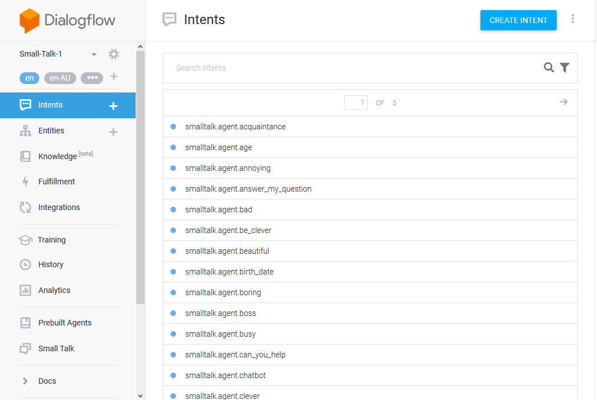
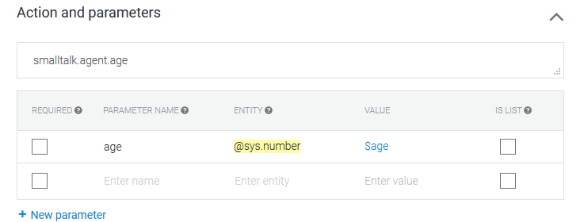
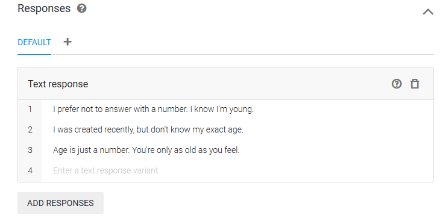

## Dialogflow Introducció

En aquesta sessió només ens centrarem amb els *Intent*. Són la part principal per tal de desenvolupar un chatbot.

## Intents

És una acció que invocarà un usuari al dir una frase o conjunt de frases determinades. Aquestes frases s'anomenen *training phrases*.

## Training phrases

Frases que faran que certa acció s'executi.

Per exemple: La training phrase: "Ok Google!" acciona l'intent "Welcome".

## Parameters

Entitats que apareixen en una training phrase i són rellevants per tal de realitzar una acció posterior.

## Responeses

